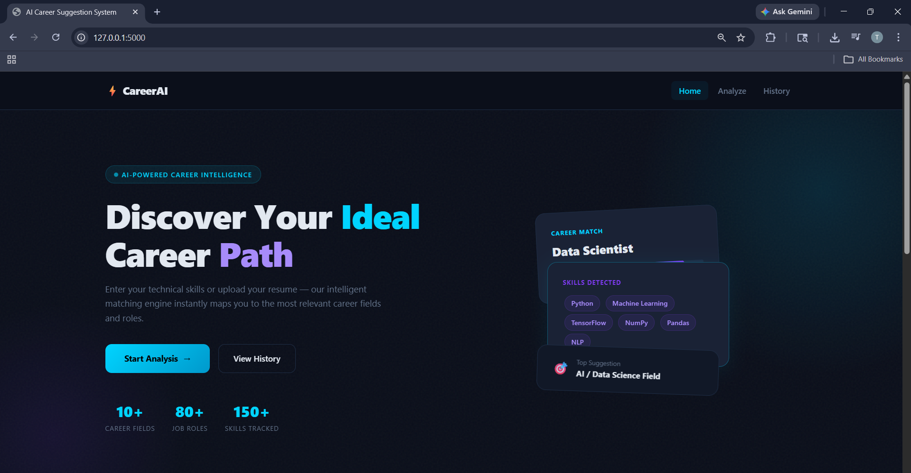
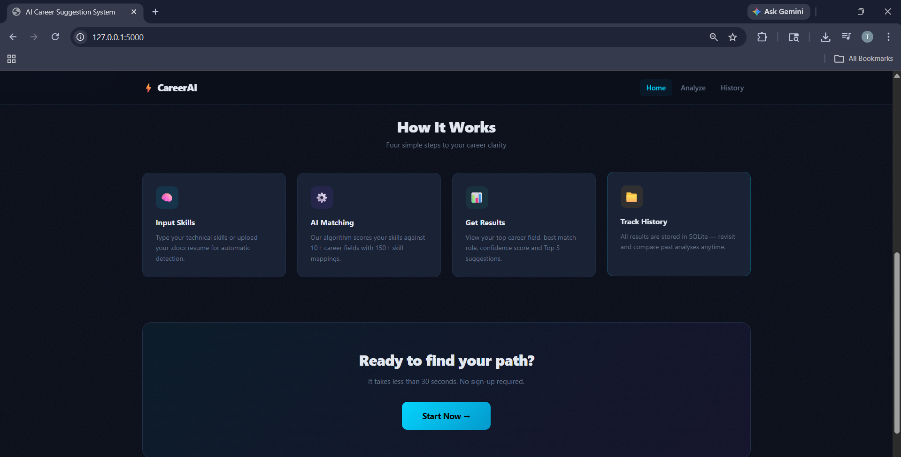
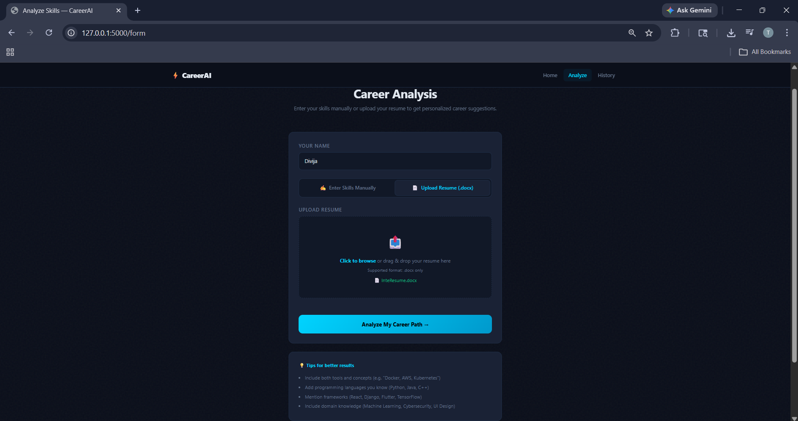
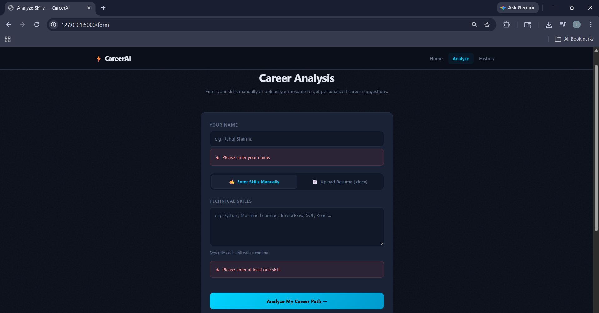
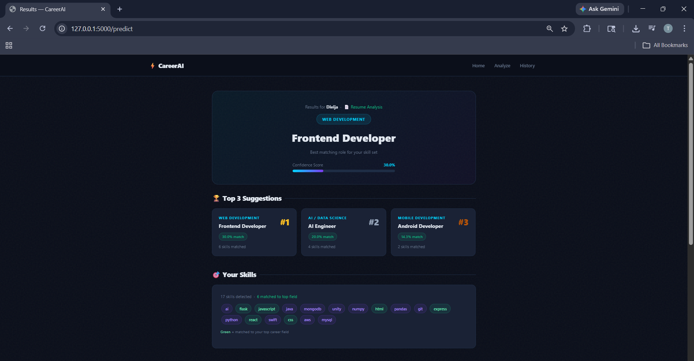
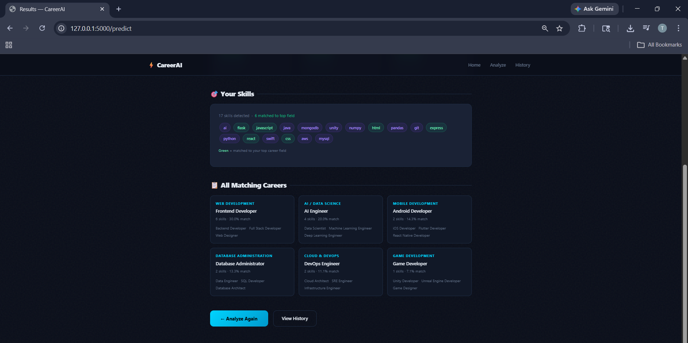
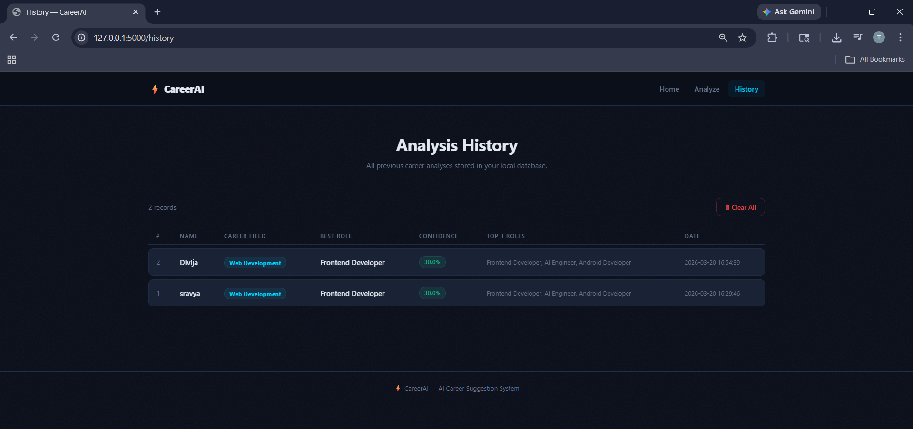

# ⚡ AI Career Suggestion System

A full-stack web application built with **Flask** that recommends career paths based on your technical skills or uploaded resume. The system analyzes your skills, matches them with a predefined dataset, and suggests the most relevant career fields and job roles with a confidence score.

---

## 🖥️ Demo Screenshots

### 🏠 Home Page




### 📝 Career Analysis Form


### ✅ Form Validation


### 🎯 Results — Top 3 Career Suggestions


### 📋 Results — All Matching Careers


### 📁 Analysis History


---

## 🚀 Features

- ✅ Enter skills manually (comma-separated)
- ✅ Upload `.docx` resume for automatic skill detection
- ✅ Skill extraction from resume text using `python-docx`
- ✅ Career matching algorithm with confidence score
- ✅ Displays best career field and best matching job role
- ✅ Top 3 career suggestions with match percentage
- ✅ All matching careers listed with skill counts
- ✅ Results stored in SQLite database
- ✅ View full analysis history
- ✅ Clear history with confirmation
- ✅ Form validation using JavaScript & jQuery
- ✅ Responsive UI using Bootstrap 5 + Custom CSS

---

## 🛠️ Technologies Used

| Layer      | Technology                                    |
|------------|-----------------------------------------------|
| Frontend   | HTML5, CSS3, Bootstrap 5, JavaScript, jQuery  |
| Backend    | Python 3, Flask                               |
| Database   | SQLite (via Python's built-in `sqlite3`)      |
| Resume     | python-docx                                   |
| Data       | JSON (`dataset.json`)                         |

---

## 📁 Folder Structure

```
AI-Career-Suggestion/
│
├── app.py                  ← Flask backend (routes, logic, DB)
├── dataset.json            ← Skills → Career Field → Roles mapping
├── career.db               ← SQLite database (auto-created)
├── requirements.txt        ← Python dependencies
│
├── static/
│   ├── css/style.css       ← Custom CSS (dark theme)
│   ├── js/validation.js    ← jQuery form validation & UI
│   └── images/             ← Project screenshots
│
├── templates/
│   ├── home.html           ← Landing page
│   ├── form.html           ← Skill input / resume upload form
│   ├── result.html         ← Career prediction results
│   └── history.html        ← Past results from SQLite
```

---

## ⚙️ Setup & Installation

### 1. Clone the repository
```bash
git clone https://github.com/YOUR_USERNAME/AI-Career-Suggestion.git
cd AI-Career-Suggestion
```

### 2. Install dependencies
```bash
pip install -r requirements.txt
```

### 3. Run the app
```bash
python app.py
```

### 4. Open in browser
```
http://localhost:5000
```

> The SQLite database (`career.db`) is created automatically on first run. No extra setup needed.

---

## 🔄 Project Workflow

```
User Opens Home Page
        ↓
  Clicks "Start Analysis"
        ↓
  Enters Skills / Uploads Resume (.docx)
        ↓
  Form Validation (JS / jQuery)
        ↓
  Skills Extracted from Resume (if uploaded)
        ↓
  Career Scoring Algorithm Runs
        ↓
  Field + Best Role + Top 3 + Confidence Calculated
        ↓
  Result Displayed to User
        ↓
  Data Stored in SQLite Database
        ↓
  User Can View History Page
```

---

## 🧠 How the Algorithm Works

1. User inputs skills (comma-separated) OR uploads a `.docx` resume
2. If resume: text is extracted and skills are detected by matching against `dataset.json`
3. Each career field is scored: **how many user skills match its skill list**
4. **Confidence Score** = `(matched_skills / total_field_skills) × 100`
5. Fields are ranked by score → top field = predicted career
6. Top 3 suggestions + all matches displayed on result page
7. Result saved to SQLite `results` table

---

## 🗃️ Database Schema

**Table: `results`**

| Column       | Type    | Description                     |
|--------------|---------|---------------------------------|
| id           | INTEGER | Auto-increment primary key      |
| name         | TEXT    | User's name                     |
| skills       | TEXT    | Comma-separated detected skills |
| field        | TEXT    | Top predicted career field      |
| best_career  | TEXT    | Best matching job role          |
| confidence   | REAL    | Confidence percentage (0–100)   |
| all_careers  | TEXT    | JSON of all matched careers     |
| top3         | TEXT    | JSON of top 3 career matches    |
| timestamp    | TEXT    | Date & time of analysis         |

---

## 🔮 Future Scope

- 📄 PDF resume support
- 👤 Login / user accounts system
- 📊 Charts and graphs using Chart.js
- 🤖 ML model (scikit-learn) for smarter predictions
- ☁️ Deploy on Render / Railway / PythonAnywhere
- 🌐 Expand dataset with more skills and career fields

---

## 👩‍💻 Author

Built as a full-stack mini project using Flask, Bootstrap, jQuery, and SQLite.
